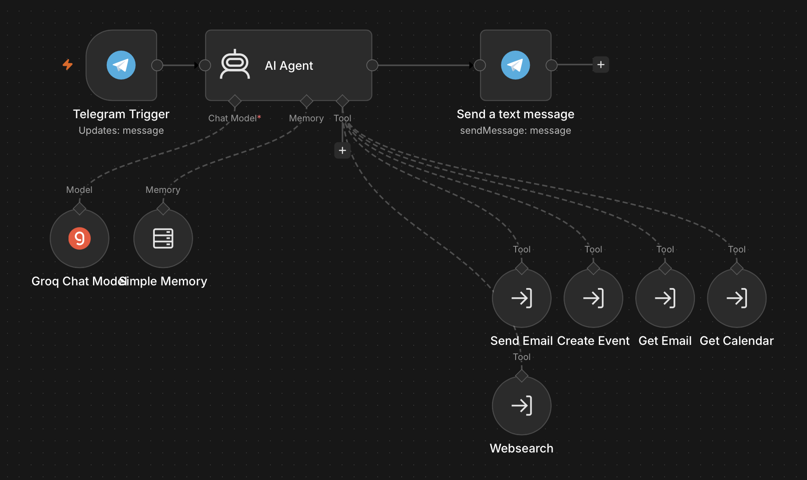

# n8n Telegram AI Assistant

A self-hosted, agentic workflow built in n8n (run via OrbStack) that interfaces with Telegram to manage emails, calendar events, and live web research. The system uses an n8n AI Agent node backed by Groq (GPT-OSS-120b) for high-speed inference, coordinating a suite of modular sub-workflows as external tool integrations.

## Architecture

The main orchestration workflow acts as the decision engine, delegating deterministic tasks to sub-workflows:

* **Entry Point**: Telegram Trigger receiving incoming user messages.
* **Core Agent**: LangChain-based AI Agent node using Simple Memory and Groq Chat Model.
* **Modular Tools (Sub-Workflows)**:
  * `tool-send-email`: Drafts and sends emails via OAuth.
  * `tool-create-event`: Schedules calendar events.
  * `tool-get-email`: Fetches and filters recent inbox items.
  * `tool-get-calendar`: Retrieves daily agenda and conflicting appointments.
  * `tool-websearch`: Executes live queries for external context.
* **Delivery**: Telegram output node sending formatted agent responses back to the chat.

## Why I Built It

Most productivity setups require switching between disjointed apps (Gmail, Google Calendar, search engines, messaging). I built this project to:
1. Consolidate personal executive tasks into a single conversational interface accessible on mobile via Telegram.
2. Evaluate real-world tool execution using high-throughput open LLMs on Groq.
3. Decouple automation logic into modular, maintainable sub-workflows instead of writing a massive monolithic main workflow.

## Setup & How to Use

### 1. Prerequisites
* n8n instance (self-hosted via Docker / OrbStack) or n8n cloud.
* Telegram Bot Token (from `@BotFather`).
* Groq Cloud API Key.
* Google Cloud Console OAuth App credentials (Calendar & Gmail scopes enabled).

### 2. Import Order
1. **Import Sub-workflows First**:
   * Navigate to n8n > **Workflows** > **Import from File**.
   * Import all files in the `sub-workflows/` directory (`tool-*.json`).
   * Authenticate the respective Google OAuth credentials inside each tool.
   * Save and activate each sub-workflow.
2. **Import Main Workflow**:
   * Import `main-agent-workflow.json`.
   * Re-link the **Tool** inputs on the AI Agent node to match the IDs of your newly imported sub-workflows.
   * Authenticate your Groq API key and Telegram Bot credentials.
   * Save and activate the workflow.

### 3. Required Configuration Note
Open the **AI Agent** node in the main workflow and edit the **System Message**:
* Replace `[Your Name]` and `(Your Name)` placeholders with your actual name so the agent accurately contextualizes incoming requests and signs off on drafted messages.

## Edge Cases & Failure Modes

* **Silent Failures & Rate Limits**: Groq's high-speed free tier has strict 20 requests-per-minute (RPM) and tokens-per-minute (TPM) limits. If the agent enters recursive tool-calling loops, requests will fail silently or drop executions without descriptive errors in the Telegram chat, only in the n8n can you see it.
* **OAuth Expiry**: Google tokens can expire or get invalidated if refresh tokens aren't handled cleanly by the local container or if you are just using Test instead of Publishing it.
* **Calendar Mismatches**: Tool calls querying "today" can fail or pull the wrong day if your n8n container timezone (`GENERIC_TIMEZONE`) doesn't match your local device timezone.

## Lessons Learned

1. **Plumbing is Harder Than Graph Logic**: Designing the graph and AI logic was the easiest part. The real friction came from structuring deterministic I/O pipelines—sanitizing incoming JSON payloads, standardizing return types from tools, and forcing the LLM to provide structured arguments rather than conversational approximations.
2. **Deterministic Data Control**: Agents struggle when given or returned an unstructured schemas. Passing strict schemas (via JS Code Validation or Set Field nodes) into sub-workflows made tool execution significantly more reliable than letting the model freely guess parameter shapes.
3. **Multi-Service OAuth Management**: Managing multiple OAuth configurations across isolated sub-workflows highlighted the necessity of unified credential scoping within n8n.
4. **Sub-Workflow Integration**: The modular structure of sub-workflows allowed for easy integration of new tools and reduced the risk of tool-specific bugs or code duplication.

## Wishlist / Roadmap

- [ ] **Persistent Memory**: Transition from the in-memory chat node to a persistent PostgreSQL or SQLite vector-ready chat history.
- [ ] **Voice Transcription**: Implement voice note handling via Telegram by piping audio files to a Whisper / local STT endpoint.
- [ ] **Free RAG Pipeline**: Connect a vector store (Chroma or Pinecone free tier) using Hugging Face serverless inference embeddings for contextual document retrieval.

## Todo/Changes
- **October 1, 2026**
- **Switched** to GROQ to Gemini 3.5 Flash-lite for TPM and RPM
- **Create a node to delete a calendar event**
- **add a budget tracker**
## Graph

